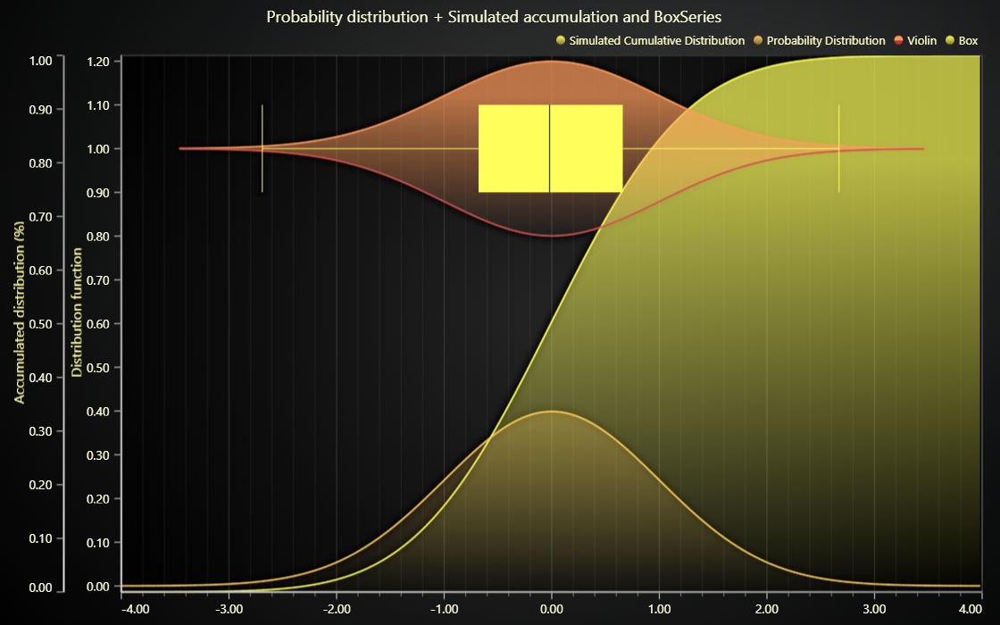

# JavaScript Box And Violin Chart

This demo application belongs to the set of examples for LightningChart JS, data visualization library for JavaScript.

LightningChart JS is entirely GPU accelerated and performance optimized charting library for presenting massive amounts of data. It offers an easy way of creating sophisticated and interactive charts and adding them to your website or web application.

The demo can be used as an example or a seed project. Local execution requires the following steps:

-   Make sure that relevant version of [Node.js](https://nodejs.org/en/download/) is installed
-   Open the project folder in a terminal:

          npm install              # fetches dependencies
          npm start                # builds an application and starts the development server

-   The application is available at _http://localhost:8080_ in your browser, webpack-dev-server provides hot reload functionality.

## Description

This example shows usage of BoxSeries in extravagant manner.

## API Links

* [Color palettes]
* [Solid FillStyle]
* [Solid LineStyle]
* [XY cartesian chart]
* [cursor modes]
* [cursor]
* [Axis]
* [Scroll strategies]
* [Box series]
* [Box and whiskers Figure]
* [Horizontal Legend box]
* [UI dragging modes]
* [UI position origins]

## Support

If you notice an error in the example code, please open an issue on [GitHub][0] repository of the entire example.

Official [API documentation][1] can be found on [LightningChart][2] website.

If the docs and other materials do not solve your problem as well as implementation help is needed, ask on [StackOverflow][3] (tagged lightningchart).

If you think you found a bug in the LightningChart JavaScript library, please contact support@lightningchart.com.

Direct developer email support can be purchased through a [Support Plan][4] or by contacting sales@lightningchart.com.

[0]: https://github.com/Arction/
[1]: https://lightningchart.com/lightningchart-js-api-documentation/
[2]: https://lightningchart.com
[3]: https://stackoverflow.com/questions/tagged/lightningchart
[4]: https://lightningchart.com/support-services/

© LightningChart Ltd 2009-2022. All rights reserved.

[Color palettes]: https://lightningchart.com/lightningchart-js-api-documentation/v4.1.0/variables/ColorPalettes.html
[Solid FillStyle]: https://lightningchart.com/lightningchart-js-api-documentation/v4.1.0/classes/SolidFill.html
[Solid LineStyle]: https://lightningchart.com/lightningchart-js-api-documentation/v4.1.0/classes/SolidLine.html
[XY cartesian chart]: https://lightningchart.com/lightningchart-js-api-documentation/v4.1.0/classes/ChartXY.html
[cursor modes]: https://lightningchart.com/lightningchart-js-api-documentation/v4.1.0/enums/AutoCursorModes.html
[cursor]: https://lightningchart.com/lightningchart-js-api-documentation/v4.1.0/interfaces/AutoCursorXY.html
[Axis]: https://lightningchart.com/lightningchart-js-api-documentation/v4.1.0/classes/Axis.html
[Scroll strategies]: https://lightningchart.com/lightningchart-js-api-documentation/v4.1.0/variables/AxisScrollStrategies.html
[Box series]: https://lightningchart.com/lightningchart-js-api-documentation/v4.1.0/classes/BoxSeries.html
[Box and whiskers Figure]: https://lightningchart.com/lightningchart-js-api-documentation/v4.1.0/classes/BoxAndWhiskers.html
[Horizontal Legend box]: https://lightningchart.com/lightningchart-js-api-documentation/v4.1.0/variables/LegendBoxBuilders.html
[UI dragging modes]: https://lightningchart.com/lightningchart-js-api-documentation/v4.1.0/enums/UIDraggingModes.html
[UI position origins]: https://lightningchart.com/lightningchart-js-api-documentation/v4.1.0/variables/UIOrigins.html

